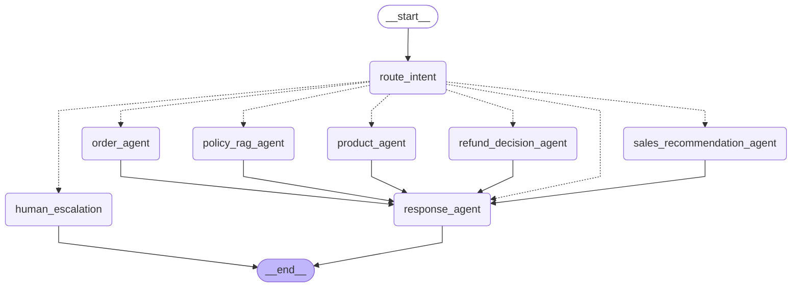

# Agent Architecture (auto-generated)

This file is generated by `scripts/generate_agent_graph.py`. Do not edit by hand — re-run the script after changing the registry.

## LangGraph Orchestrator



## Registered Agents

| Key | Name | Capabilities | Intents | Tools |
|---|---|---|---|---|
| `product_agent` | Product Agent | product_search, inventory_check, wholesale_pricing, product_comparison | product_search, product_comparison, inventory_check, wholesale_pricing | `search_products`, `check_inventory`, `get_price_for_quantity`, `get_product_by_sku`, `get_related_products` |
| `order_agent` | Order Agent | order_tracking, order_details, customer_order_history | order_tracking | `get_order_status`, `get_order_details`, `get_customer_order_history` |
| `policy_rag_agent` | Policy RAG Agent | policy_retrieval, faq_retrieval, grounded_qa | shipping_policy, payment_terms, warranty_policy, general_faq | `retrieve_policy_chunks` |
| `sales_recommendation_agent` | Sales Recommendation Agent | cross_sell, bundle_suggestion, reorder_suggestion, alternative_suggestion | sales_recommendation | `get_customer_order_history`, `search_products`, `get_related_products` |
| `refund_decision_agent` | Refund Decision Agent | refund_decision, return_eligibility, policy_reasoning, human_escalation_decision | return_refund | `get_order_details`, `retrieve_policy_chunks` |

## Routing example

```text
User: "Mua 50 thùng giấy A4 thì giá sỉ bao nhiêu?"

  → route_intent           (intent: `wholesale_pricing`, entities: {product: A4, quantity: 50})
  → product_agent          (queries products + inventory + price_tiers)
  → response_agent         (composes final answer with sources)

```
